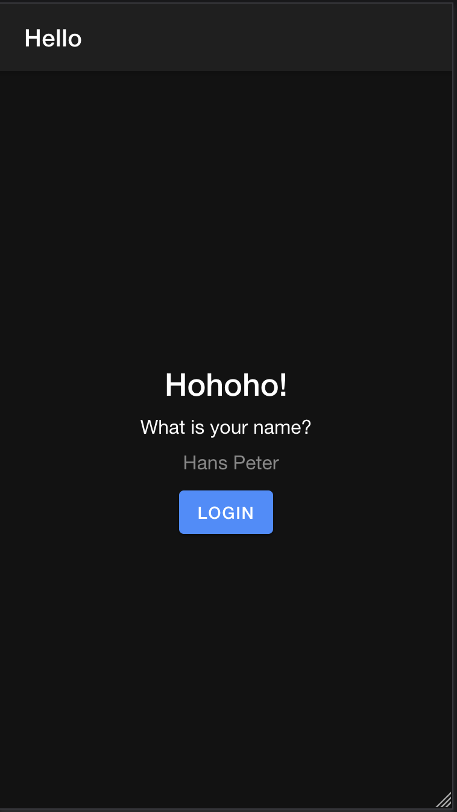
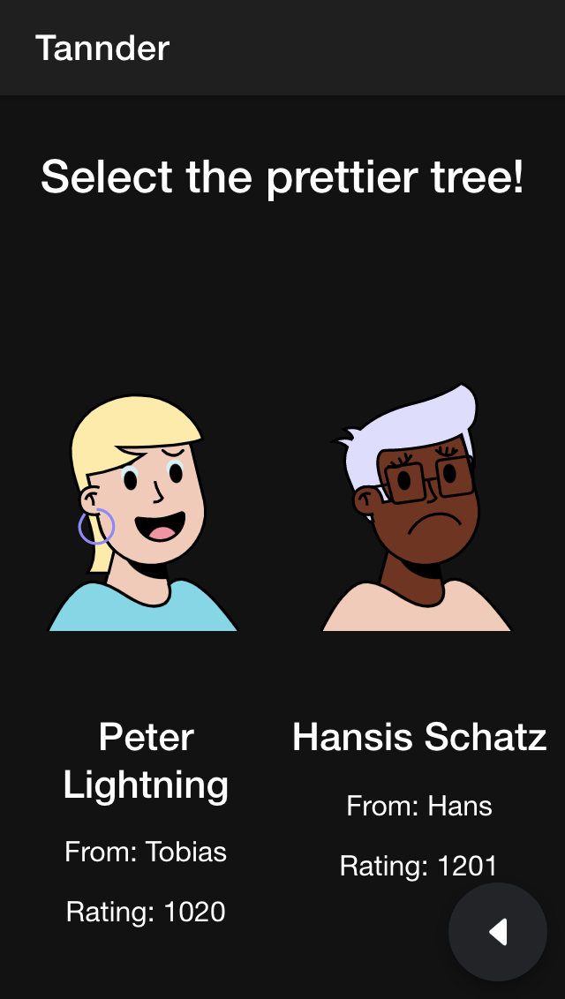

# Tannder Client Documentation

The Tannder client is made with the Ionic-Angular framework.

## Pages

The client consists the following pages:

- home
- leaderboard
- login
- map
- upload
- voting

### Login

When the user opens the app it checks weather the user has already set a name. If so the user is redirected to the Voting page. If not the user is redirected to the login page.

The login Page consists a text input and a login button. The user can enter his/her name and press the login button. This action will save the username into the local storage system.

If the now user revisits the app, the username is found in the local storage and the user will not be redirected to the app.

### Voting

The user can select one of two trees. After his selection an animation starts and in the background the selection is sent to the api and two new trees are queried.
