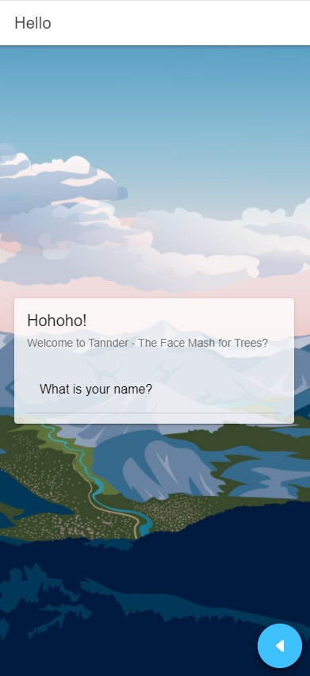
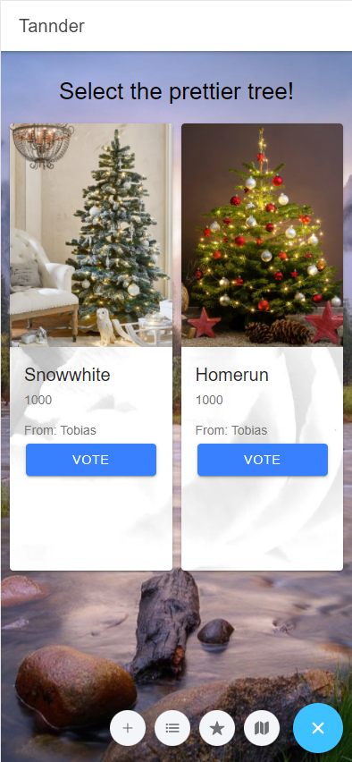
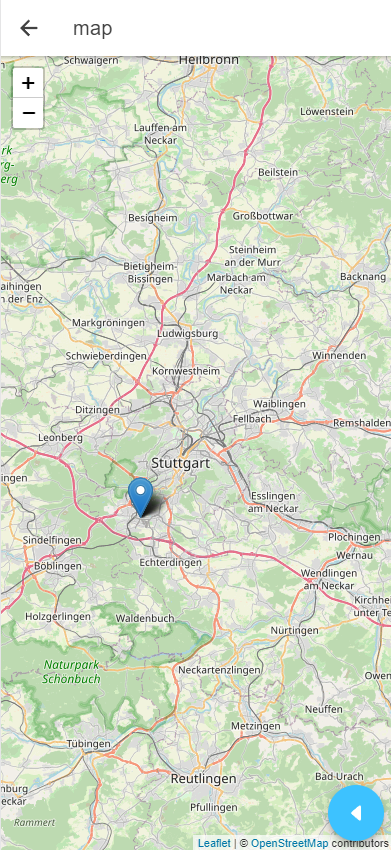
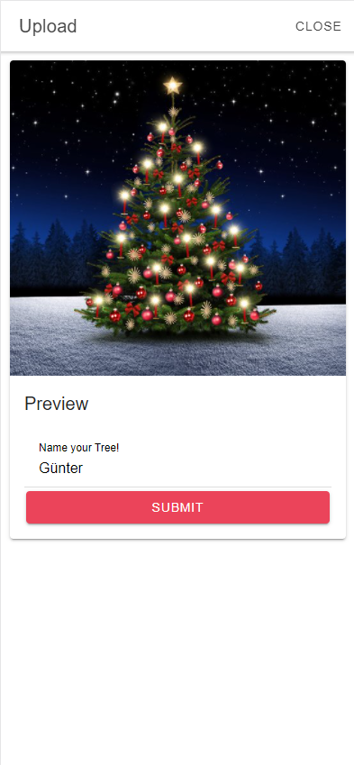
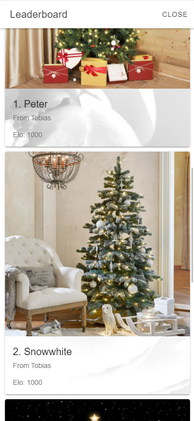

# Tannder Client Documentation

The Tannder client is made with the Ionic-Angular framework.

The client consists the following pages:

- Login
- Voting
- Map

And in-app modals accessable over the menu:

- Leaderboard
- Upload

## Login

When the user opens the app it checks weather the user has already set a name. If so the user is redirected to the Voting page. If not the user is redirected to the login page.

The login Page consists a text input and a login button. The user can enter his/her name and press the login button. This action will save the username into the local storage system.

If the now user revisits the app, the username is found in the local storage and the user will not be redirected to the app.

## Voting

The user can select one of two trees. After his selection an animation starts and in the background the selection is sent to the api and two new trees are queried.

## Map

If the user decides to click on the map icon, he is shown an OpenStreetMap, that is provided using the JavaScript-Library Leaflet and it's map-tiles. The map has different scrolling levels and enables the user to zoom in or out on the map.
This way, the user can explore the locations of trees, saved in the database, globally. The trees themselves are represented by markers placed at different coordinates and consequently different regions of the map.

## Upload

The user can open the camera with the plus icon. This activates the camera and gps. After the user mmade a photo of his tree he must enter a name for the tree. Then he can submit and the modal closes.

## Leaderboard

The user has also the ability to see the Top 10 best trees of all.
